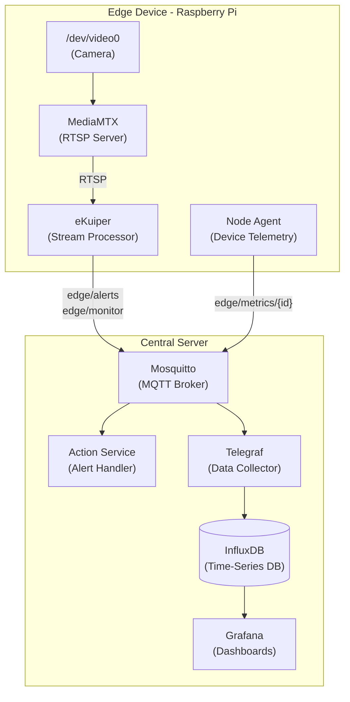
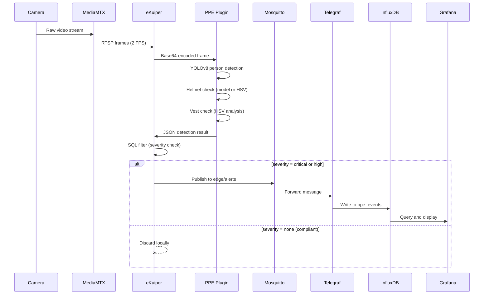
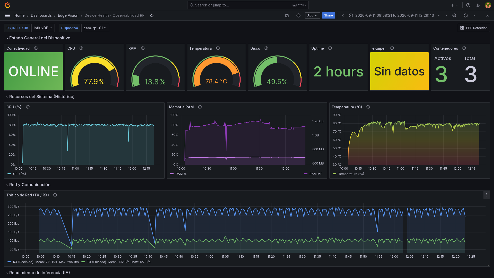
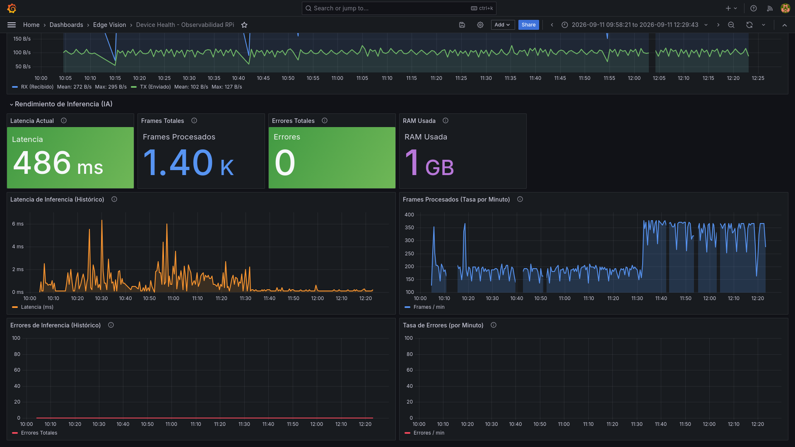
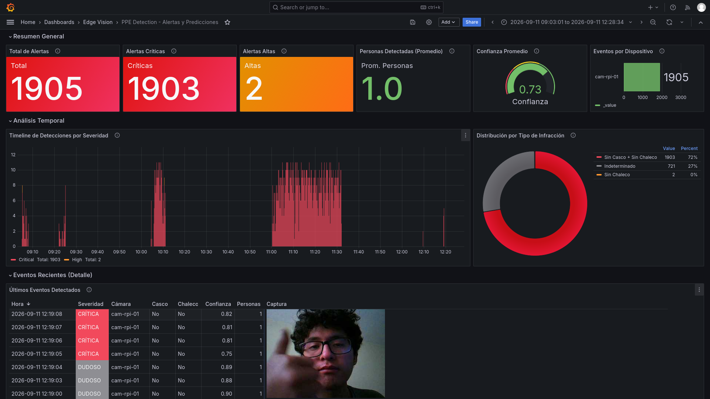
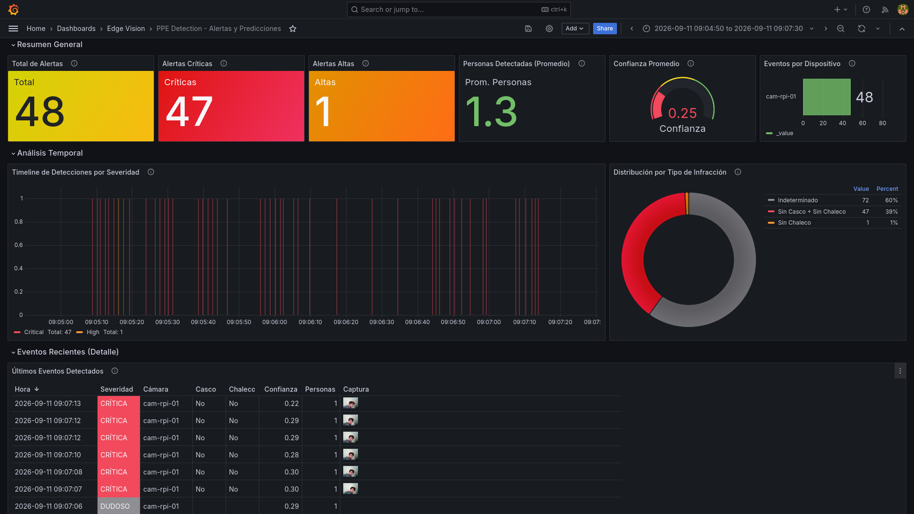

# <samp>Edge Vision System<samp>

An **Edge/IoT data engineering platform** that captures, processes, and filters sensor data locally on resource-constrained devices before transmitting only meaningful events to a central server for storage and analysis.

The current deployment uses **PPE (Personal Protective Equipment) detection** as a demonstration use case: a Raspberry Pi captures video, runs YOLOv8 inference, evaluates helmet and vest compliance, and publishes structured alerts - all without sending a single video frame over the network.


## Table of Contents

- [The Problem](#the-problem)
- [Architecture Overview](#architecture-overview)
- [Data Flow](#data-flow)
- [Components](#components)
- [MQTT Topics](#mqtt-topics)
- [Grafana Dashboards](#grafana-dashboards)
- [Dashboard Previews](#eyes-sampdashboard-previews)
- [Quick Start](#quick-start)
- [Applicability](#applicability)
- [Documentation](#documentation)

## The Problem

Industrial IoT deployments generate enormous volumes of raw data. A single camera produces roughly 5 Mbps of continuous video. Transmitting this to a centralized server is impractical in environments with limited or unreliable bandwidth (mining sites, factory floors, remote facilities).

This project implements an **edge-first** approach where heavy processing happens at the source. The raw data never leaves the device. Only lightweight, structured JSON events are transmitted, reducing bandwidth consumption by orders of magnitude.

## Architecture Overview

The system is split into two physically separate components connected over a standard network via MQTT.



**Edge Device** captures video through MediaMTX, processes it with eKuiper (which runs YOLOv8 inference via a portable Python plugin and applies SQL-based filtering rules), and publishes only relevant detection events. A lightweight Node Agent independently collects hardware telemetry.

**Central Server** receives MQTT messages through Mosquitto, ingests them via Telegraf into InfluxDB, and exposes two Grafana dashboards for analysis and device monitoring.

## Data Flow

The following diagram traces how a single camera frame is transformed into an actionable alert stored in InfluxDB:

<details>
<summary><b>Click to expand the Data Flow sequence diagram</b></summary>
<br>



A 5 MB video frame becomes a 2 KB JSON event. When no violations are detected, zero bytes are transmitted. This is the core value of edge processing.

</details>

## Components

| Component | Location | Runs On | Responsibility |
|:---|:---|:---|:---|
| **MediaMTX** | Edge Device | RPi | Captures camera via libcamera/V4L2 and serves RTSP locally |
| **eKuiper** | Edge Device | RPi | Stream processing engine: frame capture, AI inference, SQL filtering |
| **PPE Plugin** | Edge Device | RPi | YOLOv8 person detection + helmet/vest analysis (portable Python plugin) |
| **Node Agent** | Edge Device | RPi | Collects CPU, RAM, temperature, disk, network, and eKuiper metrics |
| **Mosquitto** | Central Server | Server | MQTT broker with authentication; receives events from all edge devices |
| **Action Service** | Central Server | Server | Subscribes to `edge/alerts`, logs events, publishes response recommendations |
| **Telegraf** | Central Server | Server | MQTT-to-InfluxDB bridge; parses JSON into tags and fields |
| **InfluxDB** | Central Server | Server | Time-series database storing `ppe_events` and `device_metrics` |
| **Grafana** | Central Server | Server | Dashboards for PPE alert analysis and device health monitoring |

## MQTT Topics

All communication between edge devices and the central server flows through MQTT:

| Topic | Publisher | Content | QoS |
|:---|:---|:---|:---|
| `edge/alerts` | eKuiper | Critical/high severity PPE violations with snapshot | 1 |
| `edge/monitor` | eKuiper | All non-compliant events (including lower severity) | 0 |
| `edge/metrics/{camera_id}` | Node Agent | Device hardware telemetry and eKuiper processing stats | 0 |
| `edge/actions` | Action Service | Response recommendations for received alerts | 1 |

## Grafana Dashboards

Two pre-provisioned dashboards are automatically loaded when Grafana starts:

- **PPE Detection**: Alert counts by severity, timeline analysis, violation type distribution (pie chart), and a detailed events table with rendered snapshot images.
- **Device Health**: Real-time connectivity status, CPU/RAM/temperature gauges, historical resource usage, network traffic (TX/RX), inference latency trends, frame processing rate, and error tracking.

## Dashboard Previews

The **Device Health** dashboard tracks real-time resource utilization, connectivity, and AI pipeline performance trends. The **PPE Detection** dashboard monitors inference results, providing structured compliance alerts and live visual snapshots of the edge stream.

| <b>Device Health (Observability Dashboard)</b>                                                        |
|-------------------------------------------------------------------------------------------------------|
| <a href="#--------"></a>   |
| <a href="#--------"></a>|

<br>

| <b>PPE Detection (Prediction Dashboard)</b>                                                           |
|-------------------------------------------------------------------------------------------------------|
| <a href="#--------"></a>   |
| <a href="#--------"></a>|


## Quick Start

### Prerequisites

- Docker and Docker Compose installed on both the central server and the Raspberry Pi.
- A USB or CSI camera connected to the Raspberry Pi (accessible at `/dev/video0`).
- Both machines connected to the same network.
- SSH access from the deployment machine to the Raspberry Pi.

> [!IMPORTANT]
> The AI models (YOLOv8 weights) are not included in the repository. The deployment scripts download and export them automatically, which requires Python 3.11+ and an internet connection on the machine running the deployment.

### Step 1: Deploy the Central Server

On the machine designated as the central server:

```bash
cd infrastructure/central-server
docker compose -f docker-compose.server.yml up --build -d
```

Verify all services are running:

```bash
docker ps
# Expected: mqtt-broker, edge-actions, influxdb, telegraf, grafana
```

Grafana is available at `http://<SERVER_IP>:3000` (default credentials: `admin` / `admin`).

### Step 2: Deploy the Edge Device

From a machine with SSH access to the Raspberry Pi:

```bash
bash scripts/deploy_edge.sh "tcp://<SERVER_IP>:1883"
```

This script handles everything: model preparation, code synchronization to the RPi via Git, model transfer via SCP, container startup, and eKuiper rule provisioning. It will prompt for the RPi's SSH credentials.

Alternatively, if the code and models are already on the Raspberry Pi:

```bash
MQTT_SERVER_URL="tcp://<SERVER_IP>:1883" bash scripts/start_rpi.sh
```

### Step 3: Verify

On the central server, subscribe to MQTT to confirm events are arriving:

```bash
docker exec mqtt-broker mosquitto_sub -t "edge/#" -v -u edge_device -P 'SecureEdge2026!'
```

Open Grafana at `http://<SERVER_IP>:3000` and navigate to the **PPE Detection** or **Device Health** dashboards to see live data.

> [!NOTE]
> For local development without a Raspberry Pi, a simulation mode is available that runs the entire stack on a single laptop using a USB webcam: `bash scripts/start_simulation.sh`. This is intended for development only and does not include the full central server monitoring stack.

## Applicability

While the current implementation demonstrates PPE detection, the underlying architecture (local stream processing, SQL-based filtering, MQTT transport, time-series storage, dashboard analytics) is applicable to other data-intensive scenarios:

- **Mining**: Equipment vibration monitoring, fatigue detection, perimeter security across remote sites with limited connectivity.
- **Manufacturing**: Quality control on production lines, anomaly detection in machinery sensor streams.
- **Banking and Retail**: Branch traffic flow analysis, distributed infrastructure monitoring, security event filtering before centralized processing.

These represent potential extensions. Only PPE detection is currently implemented.

## Documentation

| Document | Description |
|:---|:---|
| [Architecture](docs/architecture.md) | System topology, component responsibilities, and design rationale |
| [Edge Processing](docs/edge-processing.md) | eKuiper pipeline, AI inference plugin, SQL rules, and Node Agent |
| [Data Pipeline](docs/data-pipeline.md) | MQTT topics, Telegraf configuration, InfluxDB schema, and Grafana dashboards |
| [Deployment](docs/deployment.md) | Step-by-step deployment for central server and edge devices |
