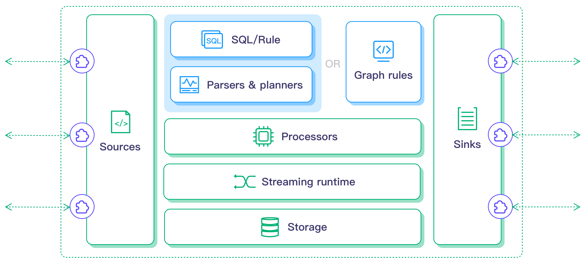

# Edge Vision System

Sistema de visión artificial y procesamiento de eventos en el borde (Edge Computing), diseñado para hardware IoT de recursos limitados.

## Objetivo

El sistema procesa flujos de video localmente en dispositivos perimetrales (Raspberry Pi 4) mediante YOLOv8 para detectar personas y verificar el uso de Equipos de Protección Personal (EPP: casco y chaleco). Solo transmite alertas estructuradas en JSON ante eventos críticos, eliminando la transmisión constante de video hacia la nube.

## Arquitectura

El sistema implementa una arquitectura de microservicios comunicados asincrónamente mediante MQTT.

| Componente | Función | Tecnología |
| :--- | :--- | :--- |
| **Detector** | Captura de video, inferencia YOLOv8, evaluación EPP y telemetría. | Python, YOLOv8, NCNN, Picamera2 |
| **Broker MQTT** | Bus asíncrono de baja latencia entre componentes. | Eclipse Mosquitto |
| **Motor de Reglas** | Stream Processing y filtrado SQL en el borde. | LF Edge eKuiper |
| **Action Service** | Respuesta reactiva ante alertas filtradas. | Python, Paho MQTT |

> [!NOTE]
> La arquitectura completa y el flujo de datos están documentados en [docs/architecture.md](docs/architecture.md).

### Motor de reglas
LF Edge eKuiper es un motor ligero de análisis de datos y procesamiento de flujos de IoT en el borde. Se trata de un servicio universal de computación en el borde o middleware diseñado para dispositivos o puertas de enlace en el borde con recursos limitados.

eKuiper está escrito en Go. La arquitectura de eKuiper es la siguiente:

 

> [!IMPORTANT]
> Como motor de reglas, los usuarios pueden enviar trabajos (también conocidos como reglas) a través de la API REST o la CLI. El analizador de reglas/SQL de eKuiper o el analizador de reglas de grafos analizará, planificará y optimizará una regla para convertirla en un flujo de procesadores que aprovechan el tiempo de ejecución en streaming y el almacenamiento si es necesario.

## Despliegue en Raspberry Pi 4

El proyecto está optimizado para Raspberry Pi 4 (OS Bookworm 64-bit) con cámara CSI. La estrategia es híbrida: la infraestructura opera en contenedores Docker y el módulo de inferencia corre nativamente para acceder a la cámara CSI vía Picamera2.

### Despliegue automatizado

El script `deploy.sh` automatiza todo el proceso: prepara los modelos NCNN en el host, sincroniza el código y los modelos en la RPi, instala dependencias y levanta el sistema.

```bash
bash scripts/deploy.sh
```

El script solicita interactivamente el usuario y la IP de la Raspberry Pi, y ejecuta los siguientes pasos:

| Paso | Acción | Equipo |
| :--- | :--- | :--- |
| 1 | Descarga modelos YOLOv8 y exporta a NCNN | Host |
| 2 | Push de commits al remoto | Host |
| 3 | Instalación de Git, Docker, picamera2, libcamera | RPi (SSH) |
| 4 | Clone/pull del repositorio | RPi (SSH) |
| 5 | Transferencia de modelos NCNN | Host a RPi |
| 6 | Levantamiento del sistema completo | RPi (SSH) |

> [!TIP]
> Para detalles de despliegue manual, conversión de modelos y troubleshooting, consultar [docs/deployment.md](docs/deployment.md).

## Entorno de Desarrollo (x86_64)

Para pruebas locales con webcam USB, el sistema se ejecuta completamente en Docker:

```bash
bash scripts/start_laptop.sh
```

Monitorear el flujo de eventos:
```bash
docker exec mqtt-broker mosquitto_sub -t "camera/events" -v    # detecciones
docker exec mqtt-broker mosquitto_sub -t "edge/alerts" -v       # alertas filtradas
```

## Capacidades Implementadas

| Capacidad | Descripción |
| :--- | :--- |
| **Detección de personas** | Inferencia YOLOv8 en tiempo real sobre frames capturados. |
| **Análisis de EPP** | Modelo fine-tuned (casco) y fallback HSV (chaleco). |
| **Abstracción de cámara** | Factory pattern: OpenCV (USB) y Picamera2 (CSI). |
| **Aceleración ARM** | Exportación PyTorch a NCNN con instrucciones NEON SIMD. |
| **Telemetría IoT** | Monitoreo de CPU, RAM, temperatura y throttling en RPi. |
| **Filtrado en el borde** | Reglas SQL en eKuiper eliminan ruido antes de alertar. |

## Aplicaciones Industriales

| Sector | Caso de uso |
| :--- | :--- |
| **HSE** | Restricción de acceso en zonas de riesgo basada en validación perimetral de EPP. |
| **Supervisión de activos** | Alertas de proximidad a maquinaria móvil ante detección humana en puntos ciegos. |
| **Redes descentralizadas** | Nodos autónomos sin saturar redes IT/OT, centralizando solo metadatos en SCADA. |

## Documentación Técnica

| Documento | Contenido |
| :--- | :--- |
| [Arquitectura y Flujo de Datos](docs/architecture.md) | Diagrama de componentes, flujo MQTT, rol de eKuiper. |
| [Sistema de Detección](docs/detector.md) | Abstracción de cámara, modelos, evaluación EPP, health monitor. |
| [Configuración y Despliegue](docs/deployment.md) | Despliegue manual, conversión de modelos, troubleshooting. |
