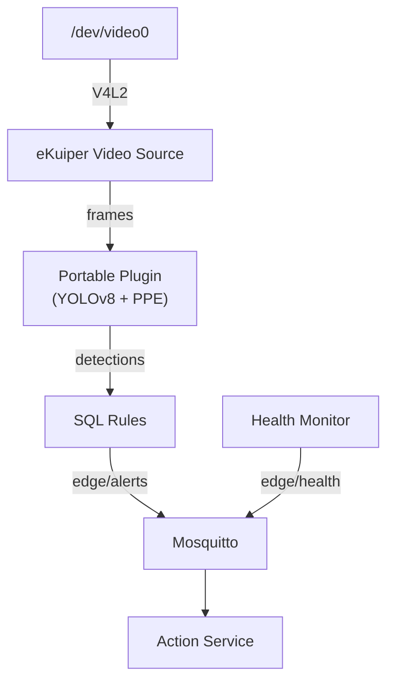

# Edge Vision System

Sistema de visión artificial para Edge Computing que procesa video localmente en dispositivos IoT (Raspberry Pi 4) mediante YOLOv8 para detectar personas y verificar el uso de Equipos de Protección Personal (EPP: casco y chaleco).

## Objetivo

Eliminar la transmisión constante de video hacia la nube. El sistema filtra inteligentemente en el borde y transmite únicamente alertas estructuradas en JSON ante eventos críticos, minimizando el consumo de ancho de banda.

## Arquitectura

El sistema implementa una arquitectura **eKuiper-nativa** donde el motor de reglas es el actor principal del pipeline:



| Componente | Función | Tecnología |
| :--- | :--- | :--- |
| **eKuiper** | Captura de video, inferencia IA, filtrado SQL, publicación de alertas | Go + Portable Python Plugin |
| **Portable Plugin** | Detección de personas (YOLOv8), análisis de EPP (modelo + HSV) | Python, Ultralytics, OpenCV |
| **Broker MQTT** | Sink para alertas filtradas, bus entre servicios | Eclipse Mosquitto |
| **Action Service** | Respuesta reactiva ante alertas | Python, Paho MQTT |
| **Health Monitor** | Telemetría del dispositivo (CPU, RAM, temperatura, throttling) | Python |

> [!NOTE]
> La arquitectura completa y el flujo de datos están documentados en [docs/architecture.md](docs/architecture.md).

## Estructura del Proyecto

```
edge-vision-system/
├── services/
│   ├── ekuiper/
│   │   └── plugins/
│   │       └── ppe_inference/        # Portable Plugin (inferencia IA)
│   │           ├── ppe_func.py       # YOLOv8 + PPE analysis
│   │           ├── ppe_inference.json # Plugin metadata
│   │           └── requirements.txt
│   ├── action_service/               # Servicio de respuesta a alertas
│   │   ├── src/action_service.py
│   │   ├── Dockerfile
│   │   └── requirements.txt
│   └── detector/                     # Legacy (models + export scripts)
│       ├── models/                   # YOLOv8 models (TFLite/NCNN/PT)
│       ├── scripts/                  # download_model.py, export_model.py
│       └── src/                      # Archived: detector.py, camera.py
├── infrastructure/
│   ├── mqtt/config/                  # mosquitto.conf
│   └── ekuiper/sources/             # video.yaml (Video Source config)
├── scripts/                          # Deployment automation
│   ├── deploy.sh                     # Full laptop → RPi deployment
│   ├── prepare_models.sh             # Download + TFLite/NCNN export
│   ├── setup_ekuiper.sh              # Video stream + SQL rules
│   ├── start_laptop.sh               # Local execution
│   └── start_rpi.sh                  # RPi execution
├── docs/                             # Technical documentation
├── docker-compose.yml                # x86_64 orchestration
└── docker-compose.rpi.yml            # ARM64 orchestration (RPi)
```

## Despliegue en Raspberry Pi 4

Todos los servicios corren en Docker. eKuiper captura video directamente del dispositivo V4L2 y ejecuta la inferencia internamente.

### Despliegue automatizado (desde la laptop)

```bash
bash scripts/deploy.sh
```

| Paso | Acción | Equipo |
| :--- | :--- | :--- |
| 1 | Descarga modelos YOLOv8, exporta a TFLite y NCNN | Laptop |
| 2 | Push de commits al remoto | Laptop |
| 3 | Instalación de Git y Docker | RPi (SSH) |
| 4 | Clone/pull del repositorio | RPi (SSH) |
| 5 | Transferencia de modelos | Laptop → RPi |
| 6 | Levantamiento del sistema | RPi (SSH) |

> [!TIP]
> Para despliegue manual y troubleshooting, consultar [docs/deployment.md](docs/deployment.md).

## Entorno de Desarrollo (x86_64)

```bash
bash scripts/start_laptop.sh
```

Monitorear alertas:
```bash
docker exec mqtt-broker mosquitto_sub -t "edge/alerts" -v
docker exec mqtt-broker mosquitto_sub -t "edge/monitor" -v
```

## Capacidades Implementadas

| Capacidad | Descripción |
| :--- | :--- |
| **Detección de personas** | YOLOv8 en tiempo real via eKuiper Portable Plugin. |
| **Análisis de EPP** | Modelo fine-tuned (casco) + fallback HSV (chaleco). |
| **Ingesta directa de video** | eKuiper Video Source plugin (V4L2/ffmpeg). |
| **Filtrado en el borde** | Reglas SQL: solo alertas critical/high llegan a MQTT. |
| **Aceleración ARM** | Exportación a TFLite (eKuiper nativo) y NCNN (NEON SIMD). |
| **Telemetría IoT** | Monitoreo de CPU, RAM, temperatura y throttling. |
| **Despliegue containerizado** | Todos los servicios en Docker, incluyendo inferencia. |

## Documentación Técnica

| Documento | Contenido |
| :--- | :--- |
| [Arquitectura y Flujo de Datos](docs/architecture.md) | Pipeline eKuiper-nativo, MQTT topics, despliegue Docker. |
| [Sistema de Detección](docs/detector.md) | Portable Plugin, modelos, evaluación EPP, health monitor. |
| [Configuración y Despliegue](docs/deployment.md) | Despliegue automatizado/manual, conversión de modelos, troubleshooting. |
