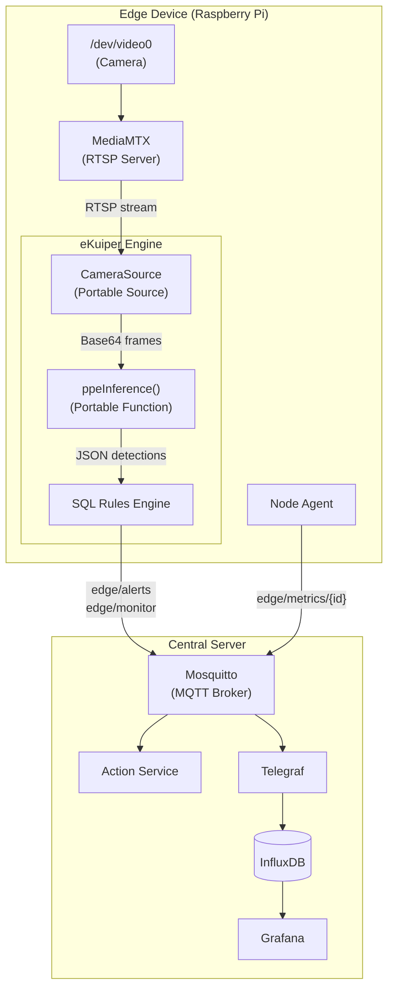

# Architecture

This document describes the system topology, the responsibilities of each component, and the rationale behind architectural decisions.

For deployment instructions, see [deployment.md](deployment.md). For details on eKuiper and AI inference, see [edge-processing.md](edge-processing.md). For the full data pipeline from MQTT to Grafana, see [data-pipeline.md](data-pipeline.md).

---

## System Topology

The Edge Vision System is physically split into two environments connected over a local network.

**Edge Devices** (one or more Raspberry Pi units) are deployed at the point of data generation. Each device captures video from a physically attached camera, processes it locally using AI inference and SQL-based stream filtering, and publishes only structured events to the central server. Raw video never leaves the device.

**The Central Server** (a laptop, on-premise server, or cloud VM) acts as the data aggregation and analysis layer. It receives MQTT messages from all edge devices, stores them in a time-series database, and exposes dashboards for operational monitoring.



---

## Edge Device Components

Each edge device runs three Docker containers orchestrated by `infrastructure/edge-device/docker-compose.device.yml`:

### MediaMTX

[MediaMTX](https://github.com/bluenviron/mediamtx) is a lightweight media server that bridges the physical camera to the software stack. On Raspberry Pi, it uses the `1-rpi` Docker image, which includes native `libcamera` support for CSI cameras.

MediaMTX captures video from the camera hardware and exposes it as a local RTSP stream at `rtsp://mediamtx:8554/cam`. This decouples camera access from the processing pipeline, allowing multiple consumers (eKuiper, manual debugging via WebRTC) to read the same stream without device-locking conflicts.

The WebRTC endpoint is exposed on port `8889` for manual visual inspection when needed.

### eKuiper

[LF Edge eKuiper](https://ekuiper.org/) is a lightweight stream processing engine designed for IoT and edge environments. It serves as the central orchestrator on the device, combining data ingestion, AI inference, and event filtering into a single container.

eKuiper runs a custom Docker image (`services/ekuiper-engine/Dockerfile`) based on `lfedge/ekuiper:1.13-slim-python` with OpenCV and Ultralytics pre-installed. It hosts a **Portable Python Plugin** (`ppe_inference`) that registers two components:

- **`cameraSource`** (Portable Source): Connects to the local RTSP stream, captures frames at a configurable rate (default: 2 FPS), encodes them as Base64 JPEG, and emits them into the eKuiper stream.
- **`ppeInference`** (Portable Function): Receives a Base64 frame, decodes it, runs YOLOv8 person detection, evaluates helmet and vest compliance for each detected person, classifies severity, and returns structured JSON.

Three SQL rules control what gets published:

| Rule | SQL Filter | Output Topic | QoS |
|:---|:---|:---|:---|
| `ppe_alert_critical` | `severity = 'critical'` | `edge/alerts` | 1 |
| `ppe_alert_high` | `severity = 'high'` | `edge/alerts` | 1 |
| `ppe_monitor` | `event_type != 'clear'` | `edge/monitor` | 0 |

The MQTT sink is configured with `sendSingle: true` (one JSON object per message, not wrapped in an array) and `maxDiskCache: 10000` for offline buffering when the network is unavailable.

For a detailed explanation of the inference pipeline and SQL rules, see [edge-processing.md](edge-processing.md).

### Node Agent

The Node Agent (`services/device-obs/node_agent.py`) is a lightweight Python script that collects device telemetry every 30 seconds and publishes it to `edge/metrics/{camera_id}`. It gathers:

- System metrics via `psutil`: CPU usage, memory (percent and MB), disk usage, network I/O counters, uptime.
- Temperature from `/sys/class/thermal` or `vcgencmd`.
- Docker container status via the Docker socket (total containers, running containers, eKuiper status).
- eKuiper processing stats via its REST API: total frames processed, inference latency, error count.

The agent is designed to consume less than 15 MB of RAM.

---

## Central Server Components

The central server runs five Docker containers orchestrated by `infrastructure/central-server/docker-compose.server.yml`:

### Mosquitto

[Eclipse Mosquitto](https://mosquitto.org/) is the MQTT broker that acts as the entry point for all edge device data. It is configured with password-based authentication (two users: `edge_device` for edge publishers, `action_service` for the action handler) and listens on port `1883` (MQTT) and `9001` (WebSocket).

### Action Service

A Python service (`services/action-service/src/action_service.py`) that subscribes to `edge/alerts`, logs each alert with severity information, and publishes response recommendations to `edge/actions`. In a production deployment, this service could be extended to trigger external actions (email notifications, API calls, relay activation).

### Telegraf

[Telegraf](https://www.influxdata.com/time-series-platform/telegraf/) bridges MQTT to InfluxDB. It subscribes to three topic patterns and uses `json_v2` parsing to decompose incoming JSON payloads into InfluxDB-compatible tags and fields.

The configuration (`infrastructure/central-server/config/telegraf/telegraf.conf`) defines three independent `mqtt_consumer` inputs, each mapping to a specific measurement in InfluxDB. See [data-pipeline.md](data-pipeline.md) for the full schema.

### InfluxDB

[InfluxDB 2.7](https://www.influxdata.com/) stores all time-series data in the `edge-data` bucket under the `edge-vision` organization. Data is retained for 30 days by default. Two measurements are maintained:

- `ppe_events`: Detection results from eKuiper (severity, event type, confidence, helmet/vest status, snapshot).
- `device_metrics`: Hardware telemetry from Node Agent (CPU, RAM, temperature, disk, network, container status, inference stats).

### Grafana

[Grafana 11.1.0](https://grafana.com/) is pre-configured with an InfluxDB datasource and two provisioned dashboards loaded automatically from `infrastructure/central-server/config/grafana/dashboards/`. Both dashboards include a `camera_id` template variable for filtering by device. See [data-pipeline.md](data-pipeline.md) for dashboard details.

---

## Network and Ports

| Service | Port | Protocol | Exposed By |
|:---|:---|:---|:---|
| Mosquitto | 1883 | MQTT | Central Server |
| Mosquitto | 9001 | WebSocket | Central Server |
| InfluxDB | 8086 | HTTP | Central Server |
| Grafana | 3000 | HTTP | Central Server |
| eKuiper REST API | 9081 | HTTP | Edge Device |
| MediaMTX WebRTC | 8889 | HTTP | Edge Device |
| MediaMTX HLS | 8888 | HTTP | Edge Device |

---

## Project Structure

```
edge-vision-system/
├── infrastructure/
│   ├── central-server/
│   │   ├── docker-compose.server.yml      # Central server orchestration
│   │   └── config/
│   │       ├── mqtt/                      # Mosquitto config + auth entrypoint
│   │       ├── telegraf/telegraf.conf     # MQTT consumer + InfluxDB output
│   │       └── grafana/                   # Provisioning, datasources, dashboards
│   ├── edge-device/
│   │   ├── docker-compose.device.yml      # Edge device orchestration (RPi)
│   │   └── config/ekuiper/               # cameraSource.yaml (RTSP config)
│   └── local-simulation/
│       └── docker-compose.simulation.yml  # All-in-one local testing
├── services/
│   ├── ekuiper-engine/
│   │   ├── Dockerfile                     # eKuiper + Python deps (OpenCV, YOLO)
│   │   └── plugins/ppe_inference/         # Portable plugin (source + function)
│   ├── ai-models/
│   │   ├── scripts/                       # download_model.py, export_model.py
│   │   └── models/                        # YOLOv8 weights (TFLite, NCNN, PT)
│   ├── device-obs/
│   │   ├── Dockerfile
│   │   └── node_agent.py                  # Hardware + eKuiper metrics collector
│   └── action-service/
│       └── src/action_service.py          # Alert handler (logs + recommendations)
├── scripts/
│   ├── deploy_system.sh                   # Full deployment (server + edge)
│   ├── deploy_edge.sh                     # Edge-only deployment to RPi via SSH
│   ├── start_rpi.sh                       # Start edge containers + provision eKuiper
│   ├── setup_ekuiper.sh                   # Register plugin, stream, and SQL rules
│   ├── prepare_models.sh                  # Download + export YOLOv8 models
│   └── start_simulation.sh               # Local laptop simulation
└── docs/
    ├── architecture.md                    # System topology and component details
    ├── edge-processing.md                 # eKuiper pipeline and AI inference
    ├── data-pipeline.md                   # MQTT, Telegraf, InfluxDB, Grafana
    └── deployment.md                      # Deployment instructions
```

## Design Rationale

### Why process at the edge?

Transmitting raw video from every camera to a central server does not scale. A single 640x480 MJPEG stream at 2 FPS still produces significant bandwidth. In contrast, a JSON detection event is roughly 2 KB. When no violations are detected, nothing is transmitted at all. This makes the system viable over bandwidth-constrained links (4G, satellite, congested WiFi).

### Why eKuiper instead of a custom Python script?

A standalone Python detector would need to manage camera access, inference scheduling, error recovery, MQTT connection handling, and offline buffering - all in a single process. eKuiper provides these capabilities natively (stream management, SQL filtering, sink buffering with disk cache, rule lifecycle management) while allowing the AI logic to remain in Python via its Portable Plugin system.

### Why MQTT instead of HTTP?

MQTT is purpose-built for IoT communication. Its minimal header overhead (2 bytes vs. hundreds for HTTP), built-in QoS levels, and pub/sub model make it significantly more efficient for high-frequency, low-payload messaging from distributed devices. The broker also acts as a natural decoupling layer: edge devices do not need to know the addresses of downstream consumers.

### Why InfluxDB instead of PostgreSQL?

Detection events and device metrics are inherently time-series data. InfluxDB is optimized for high-throughput writes with automatic time-based indexing, built-in downsampling, and a retention policy engine. Flux queries can compute aggregations (moving averages, derivatives, percentiles) over arbitrary time windows with minimal configuration.
