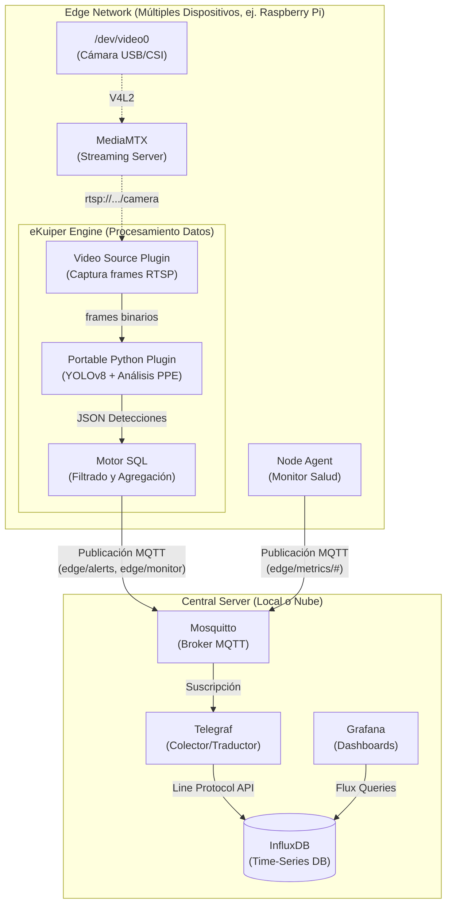

# Arquitectura del Sistema

El Edge Vision System está diseñado bajo un paradigma **Edge-First**, separando estrictamente la adquisición y el procesamiento pesado de datos (en el borde) del almacenamiento a largo plazo y la analítica (en el servidor central).

Esta separación garantiza que el sistema sea resiliente a caídas de red, escalable a cientos de dispositivos, y extremadamente eficiente en el uso del ancho de banda.

## Diagrama de Arquitectura Global

El siguiente diagrama muestra la topología completa del sistema y la separación de responsabilidades:



---

## Separación de Responsabilidades

### 1. El Borde (Edge Device)

El dispositivo edge (usualmente una Raspberry Pi 4) es responsable de las operaciones más intensivas en cómputo. Su objetivo es evitar que los datos crudos salgan del dispositivo.

*   **Adquisición de Video (MediaMTX):** Se conecta a la cámara física (`/dev/video0`) y levanta un servidor RTSP/WebRTC local. Esto permite que múltiples servicios locales (como eKuiper) consuman el flujo sin bloquear el hardware de la cámara, e incluso permite a un operador visualizar la cámara remotamente para depuración.
*   **Procesamiento y Filtrado (eKuiper):** Es el corazón del dispositivo. Extrae frames del servidor RTSP, los envía a un modelo de IA nativo (Portable Plugin con YOLOv8), evalúa las detecciones y aplica reglas SQL para decidir qué eventos ameritan ser enviados por la red.
*   **Observabilidad Local (Node Agent):** Un script ultra-ligero en Python que monitorea el estado del hardware (CPU, RAM, temperatura para evitar throttling) y el estado del contenedor de eKuiper, enviando latidos de vida (heartbeats) constantes.

### 2. El Servidor Central (Central Server)

El servidor central actúa como el agregador pasivo de todos los dispositivos de la red. Requiere de capacidades de almacenamiento y memoria para consolidar el historial operativo.

*   **Transporte (Mosquitto):** Actúa como el embudo de entrada. Recibe mensajes MQTT ligeros asíncronamente desde todos los dispositivos Edge. No procesa la información, solo la distribuye.
*   **Traducción e Ingesta (Telegraf):** Se suscribe a los tópicos MQTT. Toma el JSON estructurado emitido por eKuiper y Node Agent, lo formatea correctamente utilizando etiquetas (`tags`) y valores (`fields`), y lo inserta masivamente en InfluxDB mediante el InfluxDB Line Protocol.
*   **Almacenamiento (InfluxDB):** Base de datos optimizada para series de tiempo. Almacena dos grandes conjuntos de datos (`measurements`): los eventos de negocio (`ppe_events`) y las métricas de telemetría de los dispositivos (`device_metrics`).
*   **Visualización (Grafana):** La interfaz de usuario final. Permite a los operadores monitorear el estado de toda la red de dispositivos y auditar las detecciones de inteligencia artificial a través de dashboards interactivos.

---

## Flujo de Datos y Justificación Edge-First

Para entender el valor de esta arquitectura, analicemos cómo se transforma el dato:

1.  **Dato Crudo:** La cámara genera video a 30 FPS. Enviar esto a la nube requeriría **~5 Mbps constantes** por cámara.
2.  **Muestreo:** eKuiper captura 1 frame por segundo.
3.  **Inferencia:** El plugin de Python procesa el frame con YOLOv8. Si detecta una persona, evalúa colores y contornos para determinar si lleva casco y chaleco.
4.  **Dato Estructurado:** El frame de 5 MB se convierte en un JSON de 2 KB:
    ```json
    {
      "camera_id": "cam-rpi-01",
      "event_type": "no_vest",
      "severity": "high",
      "confidence": 0.85
    }
    ```
5.  **Filtrado SQL:** eKuiper evalúa la severidad mediante reglas SQL. Si no hay personas, o si tienen su equipo correcto, **el dato se descarta localmente**.
6.  **Transmisión:** Solo las infracciones se envían por MQTT.
7.  **Caching (Resiliencia):** Si la red WiFi de la mina o fábrica se cae, eKuiper y MQTT actúan como buffers. Guardan los eventos críticos y los despachan automáticamente cuando la conexión se restablece.

**Resultado:** Una reducción del ancho de banda del **99.9%**, permitiendo escalar a cientos de cámaras sobre redes 4G inestables o de bajo ancho de banda.
