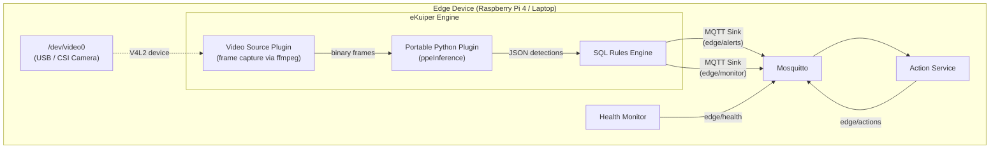

# Architecture and Data Flow

The Edge Vision System uses an **eKuiper-native architecture** where the rules engine is the primary actor. eKuiper captures video frames directly from the camera, runs AI inference through a Portable Python Plugin, and publishes only filtered alerts to MQTT.

## Architecture Diagram

## Data Flow

### 1. Frame Capture (eKuiper Video Source)

eKuiper's [Video Source Plugin](https://ekuiper.org/docs/en/latest/guide/sources/plugin/video.html) captures frames from the local camera device at a configurable interval (default: 3 seconds). The plugin uses ffmpeg internally and produces binary frame data.

Configuration: [`infrastructure/ekuiper/sources/video.yaml`](file:///home/george/George/I_programmer/Projects/edge-vision-system/infrastructure/ekuiper/sources/video.yaml)

### 2. AI Inference (Portable Python Plugin)

The `ppeInference` function ([`services/ekuiper/plugins/ppe_inference/ppe_func.py`](file:///home/george/George/I_programmer/Projects/edge-vision-system/services/ekuiper/plugins/ppe_inference/ppe_func.py)) receives raw frame bytes and executes:

| Step | Operation | Output |
|:---|:---|:---|
| Person detection | YOLOv8 (class 0 only) | Bounding boxes |
| Per-person crop | Frame slicing | Person images |
| Helmet check | PPE model or HSV fallback | detected, confidence |
| Vest check | HSV color segmentation | detected, confidence |
| Severity classification | Logic rules | event_type, severity |

The plugin returns a list of detection results (JSON) per frame.

### 3. SQL Filtering (eKuiper Rules)

eKuiper rules filter the detections and route them:

| Rule | Condition | Output Topic |
|:---|:---|:---|
| `ppe_alert_critical` | `severity = 'critical'` | `edge/alerts` |
| `ppe_alert_high` | `severity = 'high'` | `edge/alerts` |
| `ppe_monitor` | `event_type != 'clear'` | `edge/monitor` |

### 4. Action Execution (Action Service)

The action service subscribes to `edge/alerts`, logs the alert, and publishes response recommendations to `edge/actions`.

## MQTT Topic Map

| Topic | Publisher | Subscriber | Payload |
|:---|:---|:---|:---|
| `edge/alerts` | eKuiper (sink) | Action Service | Filtered critical/high alerts (JSON) |
| `edge/actions` | Action Service | External systems | Response recommendations |
| `edge/monitor` | eKuiper (sink) | Dashboards | All non-clear events |
| `edge/health` | Health Monitor | eKuiper / Dashboards | CPU, RAM, temperature |

## Key Design Decision: Why eKuiper-Native?

| Aspect | Previous (Python Detector) | Current (eKuiper-Native) |
|:---|:---|:---|
| Camera access | Python holds device exclusively | eKuiper Video Source (inside Docker) |
| Inference runtime | Python + PyTorch/NCNN (~400 MB RAM) | Portable Plugin (shared eKuiper process) |
| MQTT load | Every event published to broker | Only filtered alerts reach MQTT |
| Serialization | JSON encode → TCP → decode per frame | In-memory data between plugin and SQL |
| Docker consistency | Detector runs natively (outside Docker) | All services containerized |

## Deployment Model

| Component | Laptop (x86_64) | Raspberry Pi (ARM64) |
|:---|:---|:---|
| MQTT Broker | Docker container | Docker container |
| eKuiper + Plugin | Docker container (privileged) | Docker container (privileged) |
| Action Service | Docker container | Docker container |
| Health Monitor | Optional | Native sidecar |
