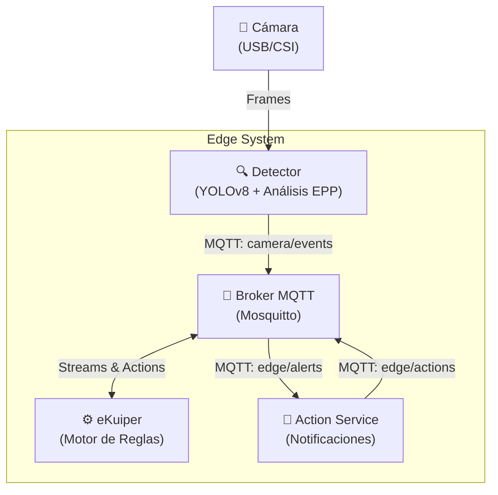

# Arquitectura y Flujo de Datos

El Edge Vision System está diseñado bajo un paradigma de microservicios orientados a eventos, utilizando MQTT como bus de mensajería central. Esta arquitectura desacoplada permite escalar componentes de forma independiente y desplegarlos en topologías variadas (todo en un dispositivo, o distribuido).

## Diagrama de Arquitectura

## Flujo de Comunicación

El flujo de procesamiento desde que se captura una imagen hasta que se emite una alerta estructurada es el siguiente:

1. **Captura y Detección (`detector`)**:
   * El servicio captura imágenes de la cámara de forma periódica, controlada por la variable `INTERVAL_SEC`.
   * Ejecuta el modelo YOLOv8 para identificar personas.
   * Por cada persona detectada, realiza un análisis de EPP (casco y chaleco).
   * El `detector` empaqueta la información en un JSON estandarizado que incluye información de telemetría y un nivel de `severity` (`critical`, `high`, `none`). Luego publica el mensaje en el topic MQTT `camera/events`.

2. **Procesamiento de Reglas (`ekuiper`)**:
   * **eKuiper** está suscrito al topic `camera/events` y trata la entrada como un flujo de datos continuo (Stream).
   * El motor evalúa cada evento frente a las reglas definidas en SQL. Por ejemplo, filtra los eventos donde `severity = 'critical'` o `severity = 'high'`.
   * Los eventos que cumplen las condiciones (alertas válidas) son republicados automáticamente por eKuiper en el topic `edge/alerts`. Otros eventos pueden ser enviados a topics de monitoreo continuo (como `edge/monitor`).

3. **Ejecución de Acciones (`action_service`)**:
   * El `action_service` escucha de forma permanente en el topic `edge/alerts`.
   * Al recibir una alerta validada por eKuiper, procesa el payload, registra la severidad de forma visible (logging), y publica una respuesta de confirmación con recomendaciones de actuación en el topic `edge/actions`.

## Integración y Rol de eKuiper

eKuiper actúa como el núcleo analítico en tiempo real del sistema. Su rol principal es **evitar la saturación del ecosistema**. En un entorno IoT/Edge real, transmitir continuamente los eventos de cada frame analizado —incluso cuando las condiciones de seguridad son normales— supondría un desperdicio masivo de recursos de red y procesamiento central.

Al colocar eKuiper directamente en el dispositivo local, se delega el filtrado en el origen:
* **Filtro de Ruido**: Transforma datos en bruto (JSON de detecciones masivas) en inteligencia procesable (alertas críticas).
* **Desacoplamiento de Lógica**: Centraliza la lógica de alerta a través de SQL declarativo, evitando que los umbrales o condiciones (ej. "enviar un email solo si severity='high'") se programen internamente (hardcoding) dentro de los scripts en Python.
