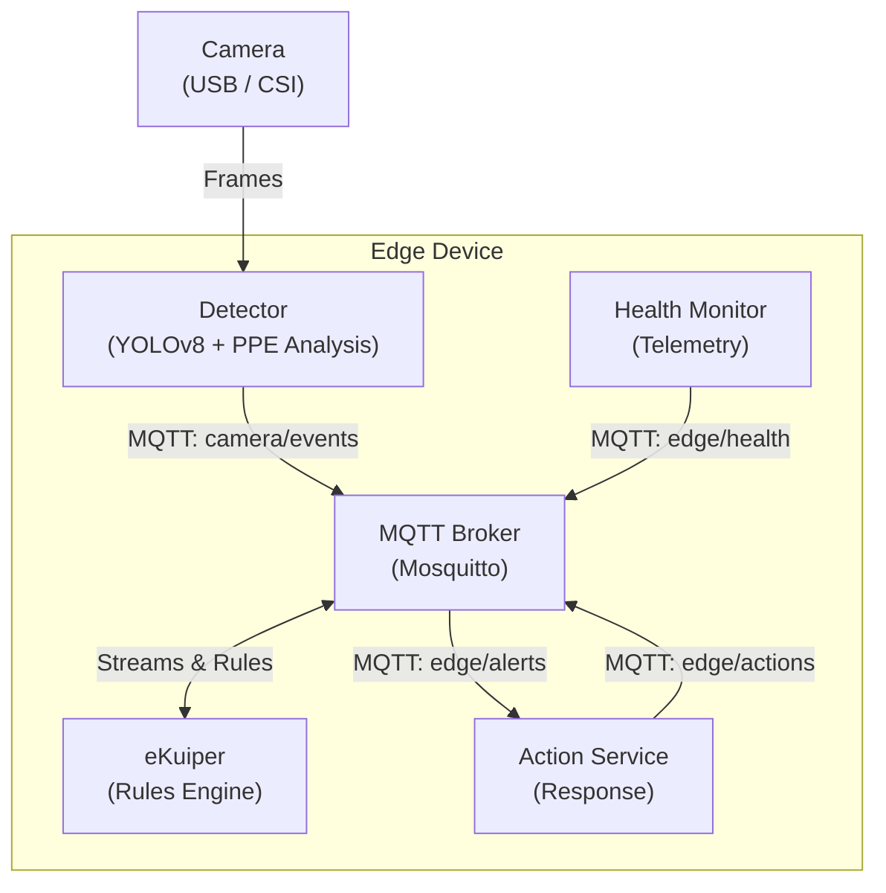

# Architecture and Data Flow

The Edge Vision System follows an event-driven microservices paradigm using MQTT as the central message bus. This decoupled architecture allows independent scaling and deployment in different topologies (single device or distributed).

## Architecture Diagram

## Communication Flow

The processing pipeline from image capture to structured alert emission:

### 1. Capture and Detection (`services/detector/src/detector.py`)

The detector captures images periodically (controlled by `INTERVAL_SEC`), runs YOLOv8 inference to identify people, and performs PPE analysis (helmet and vest) on each detected person. Results are packaged into a standardized JSON payload including telemetry data and a `severity` level (`critical`, `high`, `none`), then published to the MQTT topic `camera/events`.

### 2. Rule Processing (`ekuiper`)

eKuiper subscribes to `camera/events` and treats incoming data as a continuous stream. The engine evaluates each event against SQL rules. For example, events where `severity = 'critical'` or `severity = 'high'` are republished to `edge/alerts`. Monitoring events are sent to `edge/monitor`.

Rules are provisioned automatically by `scripts/setup_ekuiper.sh`:

| Rule | SQL Condition | Output Topic |
| :--- | :--- | :--- |
| `alert_critical` | `severity = 'critical'` | `edge/alerts` |
| `alert_high` | `severity = 'high'` | `edge/alerts` |
| `monitor_all` | `event_type != 'clear'` | `edge/monitor` |

### 3. Action Execution (`services/action_service/src/action_service.py`)

The action service listens on `edge/alerts`. Upon receiving a validated alert, it processes the payload, logs the severity, and publishes response recommendations to `edge/actions`.

## MQTT Topic Map

| Topic | Publisher | Subscriber | Payload |
| :--- | :--- | :--- | :--- |
| `camera/events` | Detector | eKuiper | Full detection results (JSON) |
| `edge/alerts` | eKuiper | Action Service | Filtered critical/high alerts |
| `edge/actions` | Action Service | External systems | Response recommendations |
| `edge/monitor` | eKuiper | Dashboards | All non-clear events |
| `edge/health` | Health Monitor | eKuiper / Dashboards | CPU, RAM, temperature |

## Role of eKuiper

eKuiper acts as the real-time analytical core. Its primary role is **preventing ecosystem saturation**. In a real IoT/Edge environment, continuously transmitting events from every analyzed frame — even when safety conditions are normal — would waste network bandwidth and central processing resources.

By placing eKuiper directly on the local device, filtering is delegated to the source:

| Function | Benefit |
| :--- | :--- |
| **Noise filtering** | Transforms raw detection JSON into actionable intelligence (critical alerts only). |
| **Logic decoupling** | Alert thresholds are defined via declarative SQL, avoiding hardcoded conditions in Python scripts. |
| **Edge autonomy** | The device operates independently; cloud connectivity is only needed for critical alerts. |

## Deployment Model

| Component | Laptop (x86_64) | Raspberry Pi (ARM64) |
| :--- | :--- | :--- |
| MQTT Broker | Docker container | Docker container |
| eKuiper | Docker container | Docker container |
| Action Service | Docker container | Docker container |
| Detector | Docker container | **Native** (Picamera2 access) |
| Health Monitor | N/A | **Native** (hardware telemetry) |

The hybrid deployment on RPi is necessary because CSI cameras require native `libcamera` access, which is not easily passed through to Docker containers.
