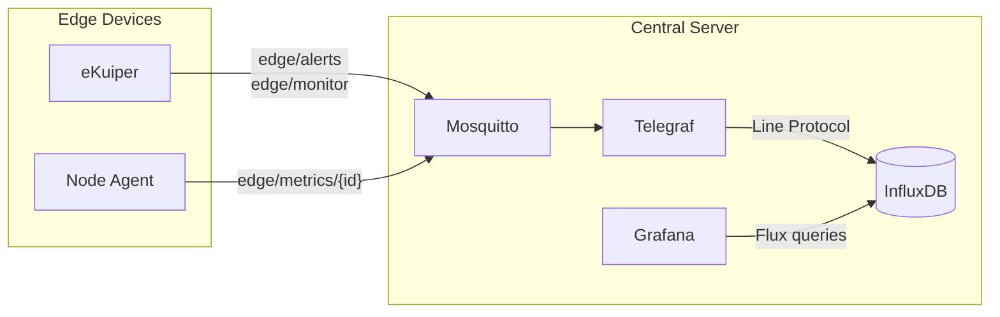

# Data Pipeline

This document traces the complete path of data from the MQTT broker on the central server through Telegraf and InfluxDB to the Grafana dashboards. It covers topic structure, JSON parsing, database schema, and dashboard design.

For the edge-side processing that produces these messages, see [edge-processing.md](edge-processing.md). For the overall system architecture, see [architecture.md](architecture.md).

---

## Pipeline Overview



---

## MQTT Topics

All edge-to-server communication uses three MQTT topic patterns. The broker (Mosquitto) running on the central server requires authentication; edge devices connect using the `edge_device` user.

### edge/alerts

Published by eKuiper when a detection has `severity = 'critical'` or `severity = 'high'`. Uses QoS 1 for reliable delivery.

```json
{
  "detection": {
    "camera_id": "cam-rpi-01",
    "timestamp": "2026-09-09T21:30:00.123Z",
    "event_type": "no_vest",
    "severity": "high",
    "confidence": 0.72,
    "persons_detected": 1,
    "helmet_detected": true,
    "helmet_confidence": 0.85,
    "vest_detected": false,
    "vest_confidence": 0.10,
    "snapshot": "/9j/4AAQSkZJ..."
  }
}
```

The `snapshot` field contains a Base64-encoded JPEG thumbnail (320x240, quality 50) and is only present for critical/high events.

### edge/monitor

Published by eKuiper for all non-compliant events (`event_type != 'clear'`). Uses QoS 0. The payload has the same structure as `edge/alerts` but omits `snapshot`, `helmet_detected`, `vest_detected`, and per-item confidence fields.

### edge/metrics/{camera_id}

Published by the Node Agent every 30 seconds. The `{camera_id}` segment identifies the source device (e.g., `edge/metrics/cam-rpi-01`).

```json
{
  "camera_id": "cam-rpi-01",
  "timestamp": "2026-09-09T21:30:30.456Z",
  "cpu_percent": 68.2,
  "memory_percent": 72.5,
  "memory_used_mb": 1420.3,
  "temperature_c": 62.1,
  "disk_percent": 34.8,
  "net_bytes_tx": 1523400,
  "net_bytes_rx": 892100,
  "uptime_seconds": 86400,
  "containers_total": 3,
  "containers_running": 3,
  "ekuiper_status": "running",
  "frames_processed": 4200,
  "inference_latency_ms": 1250.5,
  "inference_errors": 3
}
```

---

## Telegraf Configuration

Telegraf (`infrastructure/central-server/config/telegraf/telegraf.conf`) subscribes to the three MQTT topic patterns and writes to InfluxDB using the `influxdb_v2` output plugin.

Each topic has a dedicated `mqtt_consumer` input block with `json_v2` parsing. The parser extracts specific JSON paths as either **tags** (indexed, used for filtering and grouping in queries) or **fields** (values, used for aggregation and display).

### Tag and Field Mapping

**Measurement: `ppe_events`** (from `edge/alerts` and `edge/monitor`)

| JSON Path | InfluxDB Type | Purpose |
|:---|:---|:---|
| `detection.camera_id` | Tag | Device identification |
| `detection.event_type` | Tag | Violation type (grouping, filtering) |
| `detection.severity` | Tag | Alert severity (grouping, filtering) |
| `detection.confidence` | Field (float) | Detection confidence score |
| `detection.helmet_detected` | Field (bool) | Helmet compliance flag |
| `detection.vest_detected` | Field (bool) | Vest compliance flag |
| `detection.helmet_confidence` | Field (float) | Helmet model confidence |
| `detection.vest_confidence` | Field (float) | Vest model confidence |
| `detection.persons_detected` | Field (int) | Number of people in frame |
| `detection.snapshot` | Field (string) | Base64 JPEG thumbnail (optional) |
| `detection.timestamp` | Field (string) | Event timestamp from edge device |

**Measurement: `device_metrics`** (from `edge/metrics/#`)

| JSON Path | InfluxDB Type | Purpose |
|:---|:---|:---|
| `camera_id` | Tag | Device identification |
| `cpu_percent` | Field (float) | CPU utilization |
| `memory_percent` | Field (float) | RAM utilization percentage |
| `memory_used_mb` | Field (float) | RAM used in megabytes |
| `temperature_c` | Field (float) | SoC temperature |
| `disk_percent` | Field (float) | Storage utilization |
| `net_bytes_tx` | Field (int) | Cumulative bytes transmitted |
| `net_bytes_rx` | Field (int) | Cumulative bytes received |
| `uptime_seconds` | Field (int) | System uptime |
| `containers_total` | Field (int) | Total Docker containers |
| `containers_running` | Field (int) | Running Docker containers |
| `ekuiper_status` | Field (string) | eKuiper container state |
| `frames_processed` | Field (int) | Cumulative frames processed |
| `inference_latency_ms` | Field (float) | Processing latency |
| `inference_errors` | Field (int) | Cumulative inference errors |

Telegraf flushes data to InfluxDB every 10 seconds (`flush_interval = "10s"`) with a 2-second jitter to avoid write spikes.

---

## InfluxDB Schema

InfluxDB is initialized automatically on first startup with the following configuration (defined in `docker-compose.server.yml`):

| Parameter | Value |
|:---|:---|
| Organization | `edge-vision` |
| Bucket | `edge-data` |
| Retention | 30 days |
| Admin Token | `edge-vision-token-2026` (configurable via `INFLUX_TOKEN` env var) |

Data is accessed via Flux queries. Example query to retrieve the last hour of critical alerts:

```flux
from(bucket: "edge-data")
  |> range(start: -1h)
  |> filter(fn: (r) => r._measurement == "ppe_events")
  |> filter(fn: (r) => r.severity == "critical")
```

---

## Grafana Dashboards

Two dashboards are provisioned automatically via the Grafana provisioning system (`infrastructure/central-server/config/grafana/provisioning/`). Both dashboards include a `camera_id` template variable for filtering by device.

### PPE Detection (uid: `ppe-detection-main`)

Stored in `infrastructure/central-server/config/grafana/dashboards/ppe_detection.json`.

This dashboard is designed for safety analysts and provides visibility into PPE compliance events.

| Section | Panels | Purpose |
|:---|:---|:---|
| **Summary** | Total alerts, critical count, high count, average persons detected, average confidence, events by device | At-a-glance compliance overview |
| **Temporal Analysis** | Stacked bar chart (critical + high over time), donut chart by violation type | Trend identification and violation distribution |
| **Recent Events** | Table with severity, event type, helmet/vest status, confidence, snapshot image | Detailed event audit with visual evidence |

The events table renders Base64 `snapshot` values as inline images, allowing operators to visually verify detections without accessing the raw video feed.

### Device Health (uid: `device-health-main`)

Stored in `infrastructure/central-server/config/grafana/dashboards/device_health.json`.

This dashboard is designed for infrastructure engineers and provides operational visibility into the edge device fleet.

| Section | Panels | Purpose |
|:---|:---|:---|
| **Device Status** | Connectivity (online/offline), CPU gauge, RAM gauge, temperature gauge, disk gauge, uptime, eKuiper status, containers running/total | Real-time health snapshot |
| **Historical Resources** | CPU time-series, RAM time-series (dual-axis: % and MB), temperature time-series | Resource trend analysis and capacity planning |
| **Network** | TX/RX traffic rate (bytes/sec with derivative) | Bandwidth monitoring |
| **AI Performance** | Current latency, total frames processed, total errors, RAM used (MB), latency history, frames/min rate, cumulative errors, error rate/min | Inference quality and throughput monitoring |

The connectivity panel determines online/offline status by checking whether the last received metric is less than 2 minutes old. The temperature chart uses a continuous red-yellow-green color gradient to highlight thermal throttling risk zones.

---

## Data Separation

The pipeline maintains a clear separation between two categories of data:

**Business data** (`ppe_events`) represents the output of the AI inference pipeline. It answers questions about what is happening in the monitored environment: how many violations occurred, what type, when, and with what confidence.

**Operational data** (`device_metrics`) represents the health of the infrastructure itself. It answers questions about how the system is performing: is a device overheating, is inference slowing down, are errors accumulating, is a device offline.

This separation is maintained from the MQTT topic level (different topic patterns), through Telegraf (separate `mqtt_consumer` blocks), into InfluxDB (separate measurements), and up to Grafana (separate dashboards). It allows different stakeholders (safety officers vs. IT operations) to access only the data relevant to their role.
