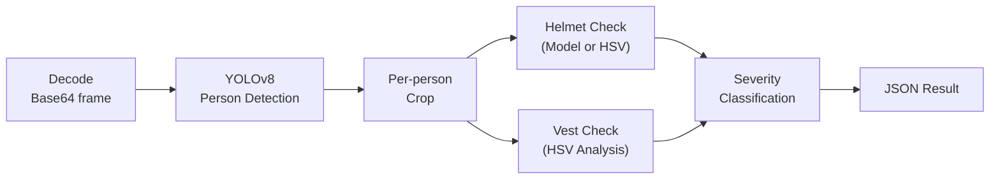

# Edge Processing

This document explains how data is captured, processed, and filtered on the edge device before being transmitted to the central server. The processing pipeline runs entirely within Docker containers on the Raspberry Pi.

For the system-level architecture, see [architecture.md](architecture.md). For the central server data pipeline, see [data-pipeline.md](data-pipeline.md).

---

## eKuiper: Stream Processing Engine

[LF Edge eKuiper](https://ekuiper.org/) is a lightweight, SQL-based stream processing engine designed for edge and IoT environments. In this system, eKuiper serves as the primary orchestrator on the device: it ingests camera frames, invokes AI inference, applies filtering rules, and publishes results to the central server via MQTT.

eKuiper is not simply executing a Python script. It provides a managed runtime with built-in capabilities for stream lifecycle management, SQL-based event filtering, MQTT sink configuration with offline buffering, and rule monitoring via a REST API. The AI inference logic is implemented in Python and loaded into eKuiper through its [Portable Plugin](https://ekuiper.org/docs/en/latest/extension/portable/python_sdk.html) system.

---

## Plugin Architecture

The `ppe_inference` portable plugin (`services/ekuiper-engine/plugins/ppe_inference/ppe_func.py`) registers two components with eKuiper:

### CameraSource (Portable Source)

The `CameraSource` class connects to the local RTSP stream served by MediaMTX at `rtsp://mediamtx:8554/cam`. It captures frames at a configurable rate (default: 2 FPS, set in `infrastructure/edge-device/config/ekuiper/cameraSource.yaml`).

For each captured frame, the source:
1. Reads a frame from the RTSP stream using OpenCV's `VideoCapture`.
2. Encodes the frame as JPEG (quality 80) and converts it to a Base64 string.
3. Emits a JSON object containing `frame` (the Base64 data), `camera_id`, and `timestamp` into the eKuiper stream.

The source includes automatic reconnection logic: if the RTSP stream is not available (e.g., MediaMTX is still starting), it retries up to 30 times with a 2-second interval. If a frame read fails during operation, the source releases and reopens the RTSP connection.

### ppeInference (Portable Function)

The `ppeInference` function is called from within eKuiper SQL rules as `ppeInference(frame)`. It receives a Base64-encoded frame and returns a structured detection result.

The inference pipeline operates in five stages:



**Stage 1 - Person Detection.** YOLOv8n (class 0 only) scans the full frame for people. The model is loaded lazily on the first invocation and cached for subsequent calls. Multiple model formats are supported with automatic selection in priority order: NCNN, TFLite, ONNX, PyTorch.

**Stage 2 - Per-person Crop.** Each detected person's bounding box is extracted as an independent image crop for individual PPE evaluation.

**Stage 3 - Helmet Check.** If a fine-tuned PPE model (`ppe_detector`) is available, it is used to detect helmet vs. bare-head classes. If the PPE model is not available (common on first deployment before training a custom model), an HSV color fallback analyzes the top 30% of the person crop for helmet-colored pixels (yellow, orange, white, red).

**Stage 4 - Vest Check.** HSV color segmentation on the torso region (30%-70% of the person crop) looks for high-visibility colors (orange and yellow neon) characteristic of reflective safety vests.

**Stage 5 - Severity Classification.** Based on the helmet and vest results:

| Helmet | Vest | Event Type | Severity |
|:---|:---|:---|:---|
| No | No | `no_helmet_no_vest` | `critical` |
| No | Yes | `no_helmet` | `high` |
| Yes | No | `no_vest` | `high` |
| Yes | Yes | `ppe_compliant` | `none` |

For `critical` or `high` severity events, a compressed 320x240 JPEG thumbnail of the full frame is attached as a Base64-encoded `snapshot` field, providing visual evidence in the Grafana events table.

**All heavy imports (OpenCV, NumPy, Ultralytics) are deferred to first use.** Module-level code executes in under 1 second to avoid triggering eKuiper's IPC handshake timeout.

---

## SQL Rules

eKuiper evaluates detection results using three SQL rules provisioned by `scripts/setup_ekuiper.sh`. Each rule reads from the `camera_frames` stream, calls `ppeInference(frame)`, and applies a WHERE clause:

```sql
-- Rule: ppe_alert_critical
SELECT ppeInference(frame) as detection
FROM camera_frames
WHERE ppeInference(frame)->severity = 'critical'

-- Rule: ppe_alert_high
SELECT ppeInference(frame) as detection
FROM camera_frames
WHERE ppeInference(frame)->severity = 'high'

-- Rule: ppe_monitor
SELECT ppeInference(frame) as detection
FROM camera_frames
WHERE ppeInference(frame)->event_type != 'clear'
```

The first two rules route to `edge/alerts` with QoS 1 (at-least-once delivery). The third routes to `edge/monitor` with QoS 0.

### Offline Buffering

Each MQTT sink is configured with `maxDiskCache: 10000` and `resendInterval: 2000`. When the network connection to the central server's MQTT broker is interrupted, eKuiper buffers events to disk and replays them automatically once connectivity is restored. This ensures that critical safety alerts are never lost, even in environments with intermittent network availability.

### Rule Provisioning

The `setup_ekuiper.sh` script is idempotent: it deletes any existing rules, streams, and plugins before recreating them. On ARM64 (Raspberry Pi), the Python plugin can take over 60 seconds to initialize (loading OpenCV, NumPy, and YOLOv8 into memory). The script includes retry logic with exponential backoff to handle this delay during rule creation.

---

## Node Agent

The Node Agent (`services/device-obs/node_agent.py`) runs as an independent container alongside eKuiper. It publishes a JSON payload to `edge/metrics/{camera_id}` every 30 seconds.

### Collected Metrics

| Category | Metric | Source |
|:---|:---|:---|
| **System** | `cpu_percent` | `psutil.cpu_percent()` |
| | `memory_percent`, `memory_used_mb` | `psutil.virtual_memory()` |
| | `disk_percent` | `psutil.disk_usage("/")` |
| | `temperature_c` | `/sys/class/thermal/thermal_zone0/temp` or `vcgencmd` |
| | `net_bytes_tx`, `net_bytes_rx` | `psutil.net_io_counters()` |
| | `uptime_seconds` | `time.time() - psutil.boot_time()` |
| **Docker** | `containers_total`, `containers_running` | Docker socket API |
| | `ekuiper_status` | Container state for `ekuiper-engine` |
| **eKuiper** | `frames_processed` | Aggregated `records_in_total` from rule status API |
| | `inference_latency_ms` | Max `process_latency_us` across rules (converted to ms) |
| | `inference_errors` | Aggregated `exceptions_total` from rule status API |

The agent connects to the central server's MQTT broker using the same credentials as eKuiper (`MQTT_SERVER_URL`, `MQTT_USERNAME`, `MQTT_PASSWORD` environment variables). It includes connection retry logic (up to 30 attempts with 5-second intervals) for resilience during startup.

---

## AI Models

The system uses two YOLOv8 models stored in `services/ai-models/models/`:

| Model | Purpose | Formats |
|:---|:---|:---|
| `yolov8n` | General person detection (COCO class 0) | PT, TFLite, NCNN, ONNX |
| `ppe_detector` | Helmet vs. bare-head classification (optional) | PT, TFLite, NCNN, ONNX |

Models are prepared by `scripts/prepare_models.sh`, which downloads the base YOLOv8n weights and exports them to TFLite (primary format for eKuiper compatibility) and NCNN (secondary format optimized for ARM NEON SIMD). The export uses a local Python virtual environment with Ultralytics installed.

> [!NOTE]
> If the `ppe_detector` model is not available, the plugin falls back to HSV color analysis for helmet detection. This fallback is less accurate but allows the system to operate without a fine-tuned model.
